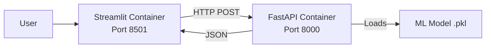

# 🤬 Toxic Comment Classifier

A full-stack Machine Learning application that detects toxic language in real-time using a microservices architecture.

---

## 📋 Overview

This project is an end-to-end Machine Learning solution designed to identify toxic comments (insults, threats, obscenity) in text.  
It is built as a distributed system with a clear separation of concerns:

- **Machine Learning**: A Scikit-Learn pipeline (TF-IDF + Logistic Regression) trained on the Kaggle Jigsaw Dataset.  
- **Backend**: A high-performance REST API built with FastAPI to serve model predictions.  
- **Frontend**: An interactive web interface built with Streamlit.  
- **Infrastructure**: Fully containerized using Docker and orchestrated with Docker Compose.

---

## 🏗 Architecture

The application follows a microservices pattern where the frontend and backend run in isolated containers and communicate over a private Docker network.



---

## 🚀 Technologies Used

* **Language**: Python 3.10
* **ML Framework**: Scikit-Learn, Pandas, Joblib
* **Backend**: FastAPI, Uvicorn, Pydantic
* **Frontend**: Streamlit
* **DevOps**: Docker, Docker Compose

---

## 🛠️ Installation & Setup

### **Prerequisites**

* Docker Desktop installed and running
* Git

### **Quick Start (Recommended)**

You can run the entire application with a single command.

**Clone the repository**

```bash
git clone https://github.com/yourusername/toxic-classifier.git
cd toxic-classifier
```

**Start the application**

```bash
docker-compose up --build
```

### **Access the App**

* **Frontend (UI)**: [http://localhost:8501](http://localhost:8501)
* **Backend (API Docs)**: [http://localhost:8000/docs](http://localhost:8000/docs)

---

## 💻 Usage

### 1. **Using the Web Interface**

Simply type a sentence into the text box and click **Analyze**.
The app will display whether the comment is **"Safe"** or **"Toxic"**, along with a confidence score.

### 2. **Using the API directly**

```bash
curl -X 'POST' \
  'http://localhost:8000/predict' \
  -H 'Content-Type: application/json' \
  -d '{
  "text": "You are amazing!"
}'
```

**Response:**

```json
{
  "is_toxic": false,
  "confidence": 0.02
}
```

---

## 📂 Project Structure

```
toxic-classifier/
├── backend/                 # FastAPI Backend
│   ├── app/
│   │   ├── main.py          # API Endpoints
│   │   ├── schemas.py       # Pydantic Models
│   │   └── resources/       # Trained ML Model (.pkl)
│   ├── Dockerfile           # Backend Container Config
│   └── requirements.txt
├── frontend/                # Streamlit Frontend
│   ├── main.py              # UI Logic
│   ├── Dockerfile           # Frontend Container Config
│   └── requirements.txt
├── model_training/          # ML Scripts
│   └── train_model.py       # Script to train and save the model
├── docker-compose.yml       # Orchestration file
└── README.md
```

---

## 🔮 Future Improvements

* Implement a Deep Learning model (BERT) for higher accuracy
* Add multi-label classification (e.g., "Insult" vs "Threat")
* Deploy to a cloud provider (AWS/GCP)

---

## 📄 License

This project is open source and available under the **MIT License**.
